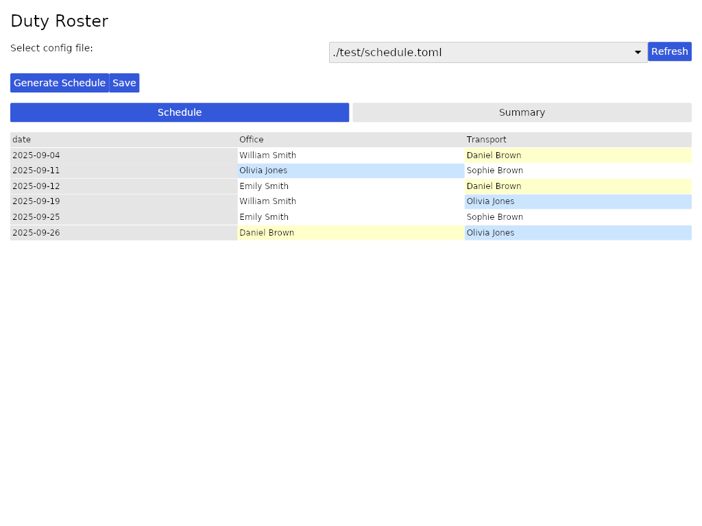
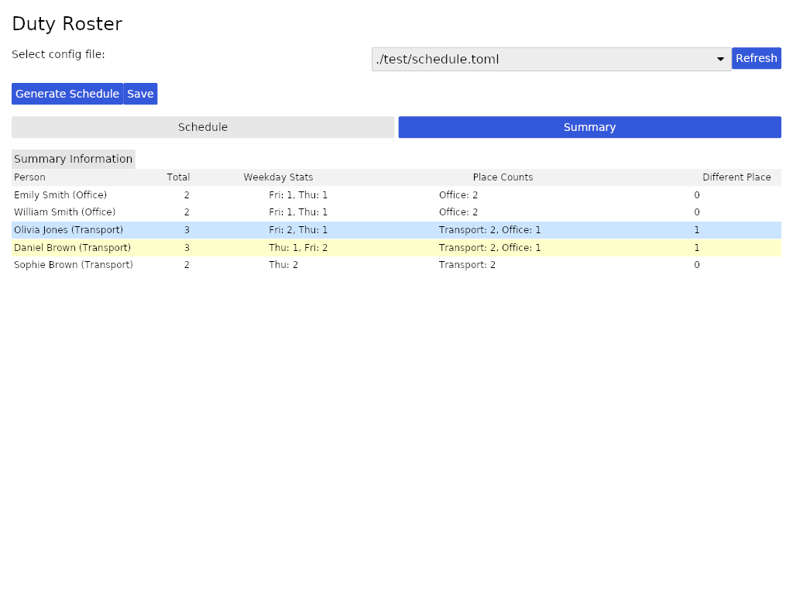

# Duty Roster

[](https://github.com/thomblin/duty-roster)
[](https://crates.io/crates/duty-roster)
[](https://docs.rs/duty-roster)
[](https://github.com/thomblin/duty-roster/actions?query=branch%3Amain)
[](https://github.com/thomblin/duty-roster/actions?query=branch%3Amain)

Duty Roster is a Rust application for creating and managing schedules for people assigned to various tasks or places over a specified date range. It features both a command-line interface and a graphical user interface built with Iced.




## Features

- **Interactive GUI**: Easily view, edit, and manage schedules through a user-friendly interface
- **Schedule Generation**: Automatically create optimized schedules based on configurable rules
- **Interactive Editing**: Click on cells to swap assignments between people
- **Highlighting**: Toggle up to 4 people highlights (grey/yellow/green/blue) in the schedule and summary views to allow faster scanning for manual adjustments
- **Statistics Tracking**: View summaries of assignments including total services, weekday counts, and more
- **CSV Export**: Save schedules to CSV files with detailed summaries
- **Configurable Rules**: Define custom rules for schedule generation in TOML files

## How to Use

### GUI Mode (Default)

Simply run the application without any arguments to launch in GUI mode:

```bash
cargo run
# or after installation
duty-roster
```

In the GUI, you can:
1. Select a configuration file from the dropdown
2. Generate a schedule
3. View and edit assignments by clicking on cells
4. Toggle highlighting of people
   - Right-click a person in the schedule table to toggle highlighting
   - Click a person in the Summary tab to toggle highlighting
   - Up to 4 people can be highlighted at once (grey/yellow/green/blue); click again to deselect
5. Save the schedule to a CSV file
6. View statistics in the Summary tab

### CLI Mode

For command-line usage, use the `--cli` flag:

```bash
cargo run -- --cli --config test/schedule.toml --out my_schedule.csv
# or after installation
duty-roster --cli --config test/schedule.toml --out my_schedule.csv
```

### Configuration

Create a TOML configuration file based on the example in [test/schedule.toml](test/schedule.toml). The configuration includes:

- **Dates**: Specify the date range and weekdays for the schedule
- **Places**: Define the locations or tasks that need to be assigned
- **Groups**: Configure groups of people and their default places
- **Rules**: Set up sorting and filtering rules for assignments

Example configuration:

```toml
[dates]
from = "2025-09-01" # first day of the resulting schedule
to = "2025-09-30" # last day of the resulting schedule
exceptions = [ # do not create a schedule for these days
    "2025-09-05",
    "2025-09-18",
]
weekdays = [ # create a schedule only on these weekdays
    "Thu",
    "Fri",
]

[places]
places = [
    "Place A",
    "Place B",
]

[[group]]
name = "Smith"
place = "Place A"

[[group.members]]
name = "Emily"

[[group.members]]
name = "William"

[rules]
# if given, sort in the following order, comment lines that should not matter
sort = [
    "sortByLeastServices", # everyone works the same amount of hours
    "sortByLastService", # prefer group who were assigned further back in the past
    "sortByLessServicesAtSameWeekday", # everyone should work on each weekday the same amount
    "sortByMaxDistanceInGroup", # seperate work for group within one "group" group evenly across the calendar
    "sortByOwnPlace", # prefer group within the same place
]
# filter by these restrictions
filter = [
# "filterSamePlace", # assign group only to their own place
]
```

## Installation

### From Cargo

```bash
cargo install duty-roster
```

### From Source

```bash
git clone https://github.com/thomblin/duty-roster.git
cd duty-roster
cargo build --release
```

The binary will be available at `target/release/duty-roster`.

## Development

### Requirements

- Rust 1.70 or later
- Cargo

### Building

```bash
cargo build
```

### Running Tests

```bash
cargo test
```

## Security

### Known Advisories

This project depends on the `iced` GUI library (v0.12.1), which has transitive dependencies with the following security advisories:

- **RUSTSEC-2024-0384**: The `instant` crate is unmaintained (transitive dependency)
- **RUSTSEC-2024-0436**: The `paste` crate is unmaintained (transitive dependency)
- **RUSTSEC-2026-0002**: The `lru` crate has a soundness issue in the `IterMut` implementation (transitive dependency)

These issues are in transitive dependencies that we cannot directly control without upgrading `iced` to a newer version, which would require significant code changes. We are monitoring these issues and will address them in a future release.

### Security Reporting

If you discover a security vulnerability in this project, please report it by creating an issue. We appreciate your help in disclosing the issue responsibly.

## License

Apache-2.0